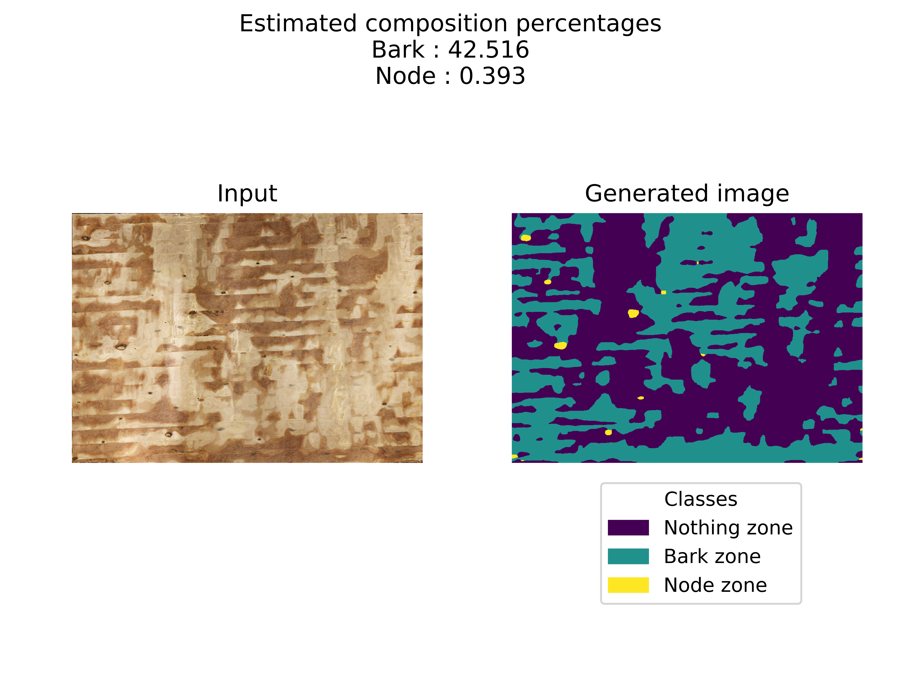

# Neural Bark Calculator
This repository contains a PyTorch based bark calculator for flattened wood log images. Given an input image, the neural network identifies bark and node regions as part of a semantic segmentation task. The input and output images are then combined into a more expressive format :



## Installation

The installation process requires both [Git](https://git-scm.com/download/win) and [Python](https://www.python.org/downloads/). Begin by download them with the provided links.

After that, clone the repository with

``git clone https://github.com/TortillasAlfred/NeuralBarkCalculator.git ``

Then, move inside the project

``cd NeuralBarkCalculator``

Since PyTorch is not installed in the same way for different OS, we recommend you first install the required PyTorch and torchvision libraries according to the [suggested commands](https://pytorch.org/). For example, on a Windows PC, the command for PyTorch is

``pip3 install https://download.pytorch.org/whl/cu90/torch-1.1.0-cp37-cp37m-win_amd64.whl``

and for torchvision it is

``pip3 install https://download.pytorch.org/whl/cu90/torchvision-0.3.0-cp37-cp37m-win_amd64.whl``

We can then download the remaining project dependencies with

``pip3 install -r requirements.txt``

## Usage

The tool lets you predict entire folders at the same time using a single command line instruction. For example, if we want to run the neural network predictions using the computer's CPU, we can type

``python3 src\bark_calculator\predict.py *ROOT_DIR* --device=cpu``

In the above command, ``*ROOT_DIR*`` is considered to be a folder with the following tree structure

```
*ROOT_DIR*
└───samples
│   └───epinette_gelee
│       │   img1.bmp
│       │   img2.bmp
│       │   ...
│   └───epinette_non_gelee
│       │   img3.bmp
│       │   img4.bmp
│       │   ...
...
```

Furthermore, it is possible to simply add ``--exclude_nodes`` to the prediction command in order to only predict the bark zones without the node zones as follows

``python3 src\bark_calculator\predict.py *ROOT_DIR* --device=cpu --exclude_nodes``

Another possible option is the ``--only_preprocess``, for which the script will only do the preprocessing part of the prediction routine, not doing the prediction of the processed samples.

Please also note that currently only 3 wood types are supported, namely ``epinette_gelee``, ``epinette_non_gelee`` and ``sapin``.

The first step of the prediction process is the image preprocessing, where each image is first resized from the expected 4096x4096 format towards a more manageable 1024x1024, before being cut horizontally to trim the usual dark regions above and below the regions of interest. This process is automatically handled by the calculator, which creates a ``processed`` subfolder to the root folder as output for the processed images.

Once the images are all processed, they are then fed one by one to the neural network, which generates the estimated bark and node regions. The results are all grouped under a ``results`` subfolder, which contains combined images as the one seen above as well as raw outputs. A ``.csv`` file is also created which contains the estimated region percentages for each input image, sorted by name and wood type.

## Under the hood

The neural network architecture used as bark calculator is based on torchvision's implementation of the [FCN](https://people.eecs.berkeley.edu/~jonlong/long_shelhamer_fcn.pdf) with a [ResNet-50](https://arxiv.org/abs/1512.03385) backbone. The network is trained following a weighted cross-entropy loss, where a specific pixel's weight is set to the maximum weight of either the predicted pixel or the expected pixel to ensure a correct precision-recall mixture. The model is selected according to the best average pixel-wise [F1-score](https://en.wikipedia.org/wiki/F1_score) on a validation set. Lastly, the images are postprocessed to eliminate any region smaller than 100 pixels from the output image.

## End notes

This document has been created in order to assist a specific group of users, which are all using Windows. Some commands might be slightly different on a Linux distribution.

Lastly, the code used for training the neural network is all inside the ``__main__.py`` file.
